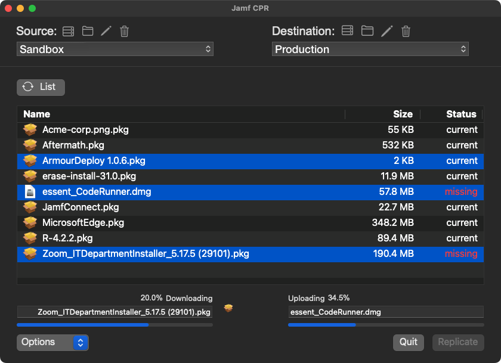
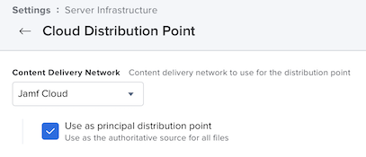
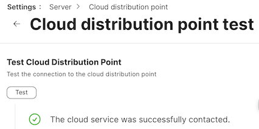
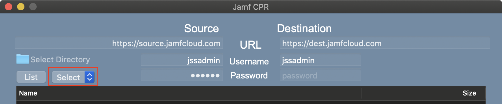
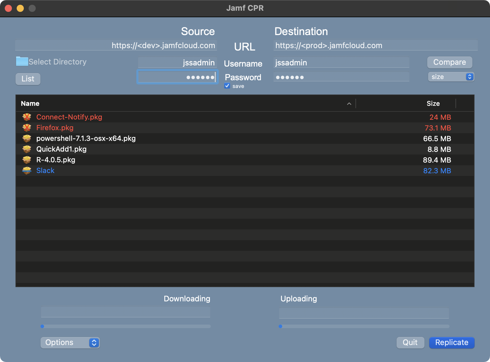

# Jamf Cloud Package Replicator 

Download: [jamfcpr](https://github.com/BIG-RAT/jamfcpr/releases/download/current/jamfcpr.zip)



Copy packages from a directory (local/mounted share/drive) or from one JCDS to another JCDS with jamfcpr.app.  **It is required the the destination JCDS be marked as the principal distribution server**.  

<br><br>
In addition, verify connectivity if no packages have been uploaded.


<br><br><br><br>

You're able to replicate packages using the following:

* Browse to a local directory or mounted share.
* Enter the URL of a Jamf Server with an on premise distribution point (DP) as the master.  Click the List button and the DP is mounted and available packages are displayed.
* Enter the URL of a Jamf Server with a JCDS as the master in the Source URL field.  Click the List button and available packages on the JCDS will be listed.
* Hold the option key while clicking the List button to select a non-master distribution point to replicate from.


<br><br>

To identify packages not currently on the destination JCDS select the attribute (checksum or size) you wish to use to compare source and destination packages, then click the Compare button.  If comparing by checksum be aware this can take a while as the checksum is generated for packages stored locally or on a mounted share.  Checksums for packages stored in the cloud do not need to be calulated as they already exist.




The text of missing packages appear in red, their icon will have a red X over it: 

If the selected attribute used to compare packages differ, the text will appear blue while the icon has blue line through it: <br><br>

Once you have a list of packages from the source server select the package(s) you wish to replicate and click the Replicate button.  For the first two methods packages are replicated from the directory/share to the JCDS.  For the last method, where a JCDS is the source, packages are downloaded to ~/Downloads/jamfcpr/, then uploaded to the destination JCDS.  By default, once the upload is complete the local copy is deleted.  This behavior can be changed by selecting Save from the Options button.  In addition you're able to select Save Only, i.e. packages will only be downloaded.
Checksums are used to determine if the package to upload differs from what is already on the JCDS. 

* To override this behavior, and force package(s) to sync, select "Force Sync" under the Options button.

Note, percents shown represent percent of current file being uploaded/downloaded.  The status bars represent the progress of all transfers.  

* It can take several minutes for packages to show as available, please be patient waiting for the 'refresh' button to disappear.  The logs can be checked to verify the upload, should see something similar to:

```
    20210512_050017 loaded file to data.
    20210512_050017 Perform upload task
    20210512_050023 	 file successfully uploaded.
    20210512_050023 Upload: security.pkg
    20210512_050023 Status: READY
```

Application log is available in ~/Library/Logs/jamfcpr/

## History

- 2021-07-16 v3.1.1:  Fixed issue (#7) where packages don't display first time app is used without clicking the Name or Size column header.  Handle failed uploads (issue #9).

- 2021-06-30 v3.1.0:  Add ability to save passwords to the keychain.  Add option to compare packages by size.  Preserve compare results when sorting by name/size.  Catch and report on failed uploads.

- 2021-06-22 v3.0.0:  Add support for using AWS (non-JCDS) as a source package distribution server.  Allow up to 3 simultaneous uploads.  Present different icons to identify missing packages or non-matching checksums between source and destination.  Correct issue where JCDS was not identified if SSO was enabled and Replicate was clicked before Compare.  Preserve display name while copying.

- 2021-06-06 v2.2.0:  Added ability to sort by Name or Size.  Added check for destination JCDS being the principal distribution point, and warn if not.

- 2021-05-31 v2.1.2:  Tracking down miscellaneous hiccups.  Add visual indication for packages with non-matching checksums (JCDS to JCDS only).

- 2021-05-21 v2.1.0: Fix crash that would result of spaces in the package name.  Add check to ensure package size doesn't exceed JCDS limit (20GB).  

- 2021-05-12 v2.0.0: Move away from dbfileuploads endpoint, upload directly to the JCDS.  Additional checks to verify authentication to the jamf server.

- 2021-04-13 v1.0.1: Fixed issue where packages would get deleted from a source AFP/SMB distribution point if being used as a source.

- 2021-03-28 v1.0.0: Fix issue where small (< ~1MB) packages failed to sync.  Add ability to identify packages not on the destination server.

- 2021-03-27: Added option to force sync (ignore matching checksums), available by selecting "Force Sync" through the Options button.

- 2021-02-17: Fixed issued authenticating against Jamf Pro v10.27 to get a list of packages from the source server.
