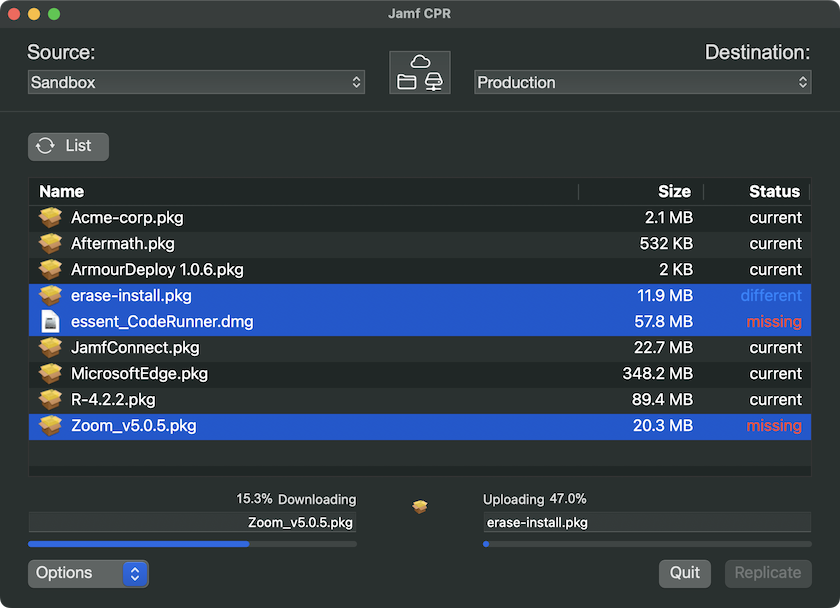

# Jamf Cloud Package Replicator 

 
    

Download the current release: [jamfCPR](https://github.com/BIG-RAT/jamfcpr/releases/latest/download/jamfcpr.zip)



Copy packages from a directory (local/mounted share/drive) or from one JCDS to another JCDS/directory/share with the jamfCPR app.  Shares can include local distribution points.  Note, shares must be mounted in advance of replicating.  The application is scriptable, see the Wiki for more.
<br><br>
Verify connectivity if no packages have been uploaded.


<br><br>


Packages can be sorted by name, size, or status.  The status column makes it easy to see what packages need updating.
<br><br>

Once you have a list of packages from the source server select the package(s) you wish to replicate and click the Replicate button.  For the first two methods packages are replicated from the source JCDS/directory/share to the destination JCDS/directory/share.  For the last method, where a JCDS is the source, packages are downloaded to ~/Downloads/jamfcpr/, then uploaded to the destination JCDS.  By default, once the upload is complete the local copy is deleted.  This behavior can be changed by selecting Save from the Options button.  In addition you're able to select Save Only, i.e. packages will only be downloaded.
Checksums are used to determine if the package to upload differs from what is already on the JCDS. 

* To override this behavior, and force package(s) to sync, select "Force Sync" under the Options button.

Note, percents shown represent percent of current file being uploaded/downloaded.  The status bars below the downloading/uploading text fields represent the progress of all transfers.  

* It can take several minutes for packages to show as available (Jamf Pro syncs with the JCDS once an hour), please be patient waiting for the 'refresh' button to disappear.  The logs can be checked to verify the upload, should see something similar to:

```
    20210512_050017 loaded file to data.
    20210512_050017 Perform upload task
    20210512_050023 	 file successfully uploaded.
    20210512_050023 Upload: security.pkg
    20210512_050023 Status: READY
```

Application log is available in ~/Library/Logs/jamfcpr/.  You can quickly access the logs folder from the menu bar, View --> Show Logs or ⌘-L.

View the [Wiki](https://github.com/BIG-RAT/jamfcpr/wiki) for additinal information.

## History

- 2024-01-02 v4.0.2:  Better error handling, better handling of concurrent operations, better handling of bearer token.

- 2024-01-02 v4.0.2-b1:  Redesign of the interface. Updated to be compatible with JCDS2 (only).  Enable command line usage.

- 2022-11-19 v3.5.0:  Fix issue with bearer token only authentication to the Classic API.  Changes to the UI, ability to hide username/password fields.  Modify permissions check, user needs User Jamf Admin and Save With Jamf Admin privileges to migrate packages.  Add information (when it was uploaded, account used to upload, and that is was uploaded with jamfCPR) to the Notes section for a package in Jamf Pro.

- 2022-07-18 v3.3.4:  Resolve issue with international characters and crash when clicking on an empty list of packages; issue #12.

- 2022-07-12 v3.3.3:  Resolve issue with destination information (URL/credentials) when running in Save Only mode.  Destination information is no longer required with Save Only mode; issue #11.

- 2022-05-04 v3.3.2:  Resolve potential authentication issue with servers that have limited access configured.

- 2022-03-04 v3.3.1:  Increase stability.  Only calculate checksum for selected packages.  Provide feedback while checksums are calculated.  Get list of packages from destination after retrieving source packages and identify packages not on the destination server.  Support bearer token authentication to the Classic API.  Retain selected items after comparing checksum/size.  Added shortcut to open logs folder.

- 2021-12-08 v3.1.5:  Improved stability.  Added animation while information is being retrieved from the destination server.

- 2021-07-16 v3.1.1:  Fixed issue (#7) where packages don't display first time app is used without clicking the Name or Size column header.  Handle failed uploads (issue #9).

- 2021-06-30 v3.1.0:  Add ability to save passwords to the keychain.  Add option to compare packages by size.  Preserve compare results when sorting by name/size.  Catch and report on failed uploads.

- 2021-06-22 v3.0.0:  Add support for using AWS (non-JCDS) as a source package distribution server.  Allow up to 3 simultaneous uploads.  Present different icons to identify missing packages or non-matching checksums between source and destination.  Correct issue where JCDS was not identified if SSO was enabled and Replicate was clicked before Compare.  Preserve display name while copying.

- 2021-06-06 v2.2.0:  Added ability to sort by Name or Size.  Added check for destination JCDS being the principal distribution point, and warn if not.

- 2021-05-31 v2.1.2:  Tracking down miscellaneous hiccups.  Add visual indication for packages with non-matching checksums (JCDS to JCDS only).

- 2021-05-21 v2.1.0: Fix crash that would result of spaces in the package name.  Add check to ensure package size doesn't exceed JCDS limit (20GB).  

- 2021-05-12 v2.0.0: Move away from dbfileuploads endpoint, upload directly to the JCDS.  Additional checks to verify authentication to the jamf server.

- 2021-04-13 v1.0.1: Fixed issue where packages would get deleted from a source AFP/SMB distribution point if being used as a source.

- 2021-03-28 v1.0.0: Fix issue where small (< ~1MB) packages failed to sync.  Add ability to identify packages not on the destination server.

- 2021-03-27: Added option to force sync (ignore matching checksums), available by selecting "Force Sync" through the Options button.

- 2021-02-17: Fixed issued authenticating against Jamf Pro v10.27 to get a list of packages from the source server.
